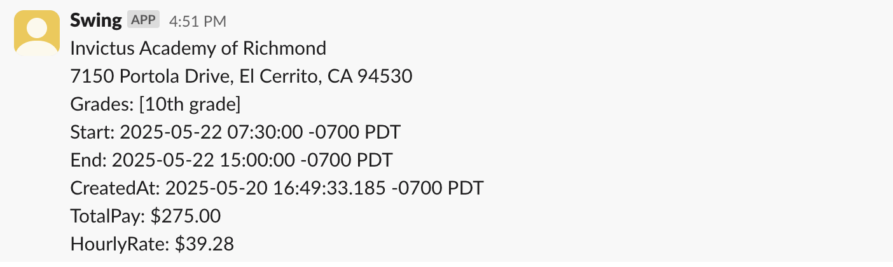

This project is to poll [Swing Education](https://swingeducation.com) openings and send new openings to the Slack channel that you designated so that your phone can recieve openings immediately through Slack notifications. The fastest it can poll is every 10 seconds. To avoid bot detection, the polling will also go to sleep between 00:00 to 04:59 in the midnight.

Please make sure you have a `.swing-secrets.yaml` in your home dir:
```
% cat ~/.swing-secrets.yaml 
googleToken: AMf-vBwpSdT-6EjzxaVQ...
slackToken: xoxb-261...
slackChannel: C08T5T2LY21
interval: 30
```

To build (with `env GOOS=linux GOARCH=arm`)
```
make build
```

To deploy (to a Raspberry Pi, with `export PI_AT_HOST=pi@<your Raspberry Pi hostname>.local`)
```
make deploy
```

Run the worker:
```
./swing-cli list-worker
```


Sample Notification
